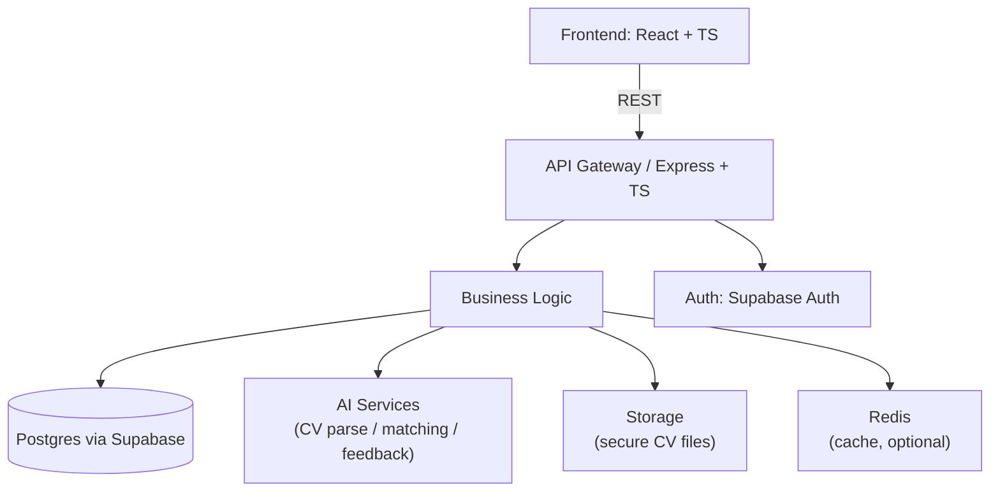

# SkillSync — AI-powered job matching for Vietnam

> **SkillSync** is an MVP recruitment platform focused on the Vietnamese market.
> It helps new grads and young workers upload CVs (PDF/DOCX/plain text), automatically extracts profile data, matches candidates to jobs using AI scoring, and offers mock interview practice in Vietnamese/English. Employers can post jobs and search candidates.

---

## Table of Contents

- [Overview](#overview)
    - [Scope & Constraints](#scope--constraints)
    - [Goals](#goals)
- [Features (MVP)](#features-mvp)
    - [Acceptance Highlights](#acceptance-highlights)
- [Architecture & Rationale](#architecture--rationale)
    - [Why These Choices](#why-these-choices)
- [Security & Privacy](#security--privacy)
    - [NFR-001 Security](#nfr-001-security)
    - [Data Minimization](#data-minimization)
- [Performance & Scalability](#performance--scalability)
    - [NFR-002 Performance](#nfr-002-performance)
    - [NFR-003 Scalability](#nfr-003-scalability)
- [Local Development](#local-development)
    - [Prerequisites](#prerequisites)
    - [Example `.env`](#example-env)
    - [Install & Run](#install--run)
- [Deployment & Infra Suggestions](#deployment--infra-suggestions)
    - [MVP Stack](#mvp-stack)
    - [Monitoring](#monitoring)
    - [Backup & DR](#backup--dr)
- [Contribution](#contribution)
    - [How to Contribute](#how-to-contribute)
    - [PR Checklist](#pr-checklist)
- [Roadmap & TODOs](#roadmap--todos)
    - [Short-term (MVP)](#short-term-mvp)
    - [Future (post-MVP)](#future-post-mvp)
- [Known Limitations](#known-limitations)
- [License](#license)
- [Contact](#contact)
- [Quick Copy Checklist](#quick-copy-checklist)

---

# Overview

**Scope & constraints**

- Market: **Vietnam only** (Vietnamese language support required).
- Users: **SMEs / Startups (employers)** and **new grads / young workers (job seekers)**.
- Excluded from MVP: payment integration, enterprise SSO, large-scale analytics.
- Data formats: `PDF`, `DOCX`, plain text (UTF-8).
- Privacy principle: **data minimization**, store only required fields and transient raw files only when necessary.

**Goals**

- Let job seekers create a profile by uploading CVs (automatic parsing).
- Provide AI job matching and explainability (why a job is recommended).
- Offer mock interview simulations with quick feedback in Vietnamese/English.
- Provide core employer workflows: job posting, candidate search, application management.

---

# Features (MVP)

| ID     |                                                                                       Feature | Priority | Complexity |
| ------ | --------------------------------------------------------------------------------------------: | -------: | ---------: |
| FR-001 | CV Upload & Parsing (PDF/DOCX/text) — extracts name, email, phone, skills, experience summary | **Must** |     Medium |
| FR-002 |                                                     AI Job Matching — top 10 jobs, score >60% | **Must** |       High |
| FR-003 |                                     Mock Interview Simulation — 5–8 questions, feedback < 30s | **Must** |       High |
| FR-004 |                                                     Employer Job Posting — create/manage jobs | **Must** |        Low |
| FR-005 |                                                                    Candidate Search & filters |   Should |     Medium |
| FR-006 |                                                      Application Management — status tracking |   Should |        Low |
| FR-007 |                                                Profile Management — manual edits & enrichment |   Should |        Low |

**Acceptance highlights**

- FR-001: extraction accuracy target **≥ 80%** for name/email/skills on Vietnamese CVs. Phone normalized to `+84` format when applicable.
- FR-002: when requesting matches for a complete profile → return **top 10** jobs with score **> 60%**. Filtered results update within **2s**.
- FR-003: start interview → provides **5–8** contextual questions; feedback returned within **30s**.

---

# Architecture & rationale

**High-level design:** layered _monolithic_ architecture (presentation, API gateway, business logic, data access, external integration, cross-cutting concerns). Designed to be maintainable by a junior team and to support Vietnamese language needs.

Key modules:

- CV Processing (parsing → extraction → normalization)
- Job Matching (AI scoring & explanation)
- Interview Simulation (question generation + feedback)
- Job Management (posting, updates)
- Application Workflow (status transitions)
- User Profile

Cross-cutting: Supabase Auth (JWT), Redis caching (optional), structured logging, rate limiting, input sanitization, RLS policies in DB.

Mermaid overview:



**Why these choices**

- React + TypeScript (frontend) — component reuse + i18n support for Vietnamese.
- Express + TypeScript (backend) — lightweight middleware model; simple for junior team.
- Supabase (Postgres) — built-in auth, real-time, RLS and JSON support for extracted CV data.
- Jest for testing; Redis optional for caching; AI integrations via adapter pattern.

---

# Security & privacy

**NFR-001 Security**

- All PII encrypted-at-rest; TLS for in-transit.
- Supabase RLS policies to ensure row-level access control.
- Quarterly penetration tests & automated scanning (Snyk/Dependabot recommended).
- Virus scanning on file upload.

**Data minimization**

- Only store fields required for matching and legal/regulatory needs.
- Provide process to permanently delete a user's data on request.

---

# Performance & scalability

**NFR-002 Performance**

- Target API p95 < 500ms for typical CRUD endpoints; heavy operations (matching) may be cached or processed asynchronously with short TTLs for results.
- Use Redis for caching hot job lists / match results (optional for MVP if needed).

**NFR-003 Scalability**

- Horizontal scaling of the API layer and stateless design using Supabase/Postgres for persistence.
- Use pagination and streaming for large queries.

---

# Local development (copy-paste)

### Connecting to the Supabase Project

To ensure everyone is working with the same Supabase backend, follow these steps:

1.  **Install the Supabase CLI** (if you haven't already):

    ```bash
    npm install supabase --save-dev
    ```

2.  **Log in to the Supabase CLI:**
    This will require you to create a Supabase account if you don't have one.

    ```bash
    npx supabase login
    ```

    Follow the instructions in your browser to authorize the CLI.

3.  **Link your local project to the remote Supabase project:**
    You will need the **Project Reference ID**. Ask the project maintainer for this value.

    ```bash
    # Replace <project-ref> with the ID provided to you
    npx supabase link --project-ref <project-ref>
    ```

    You will be prompted for the database password, which you can also get from the project maintainer.

4.  **(Optional) Generating Database Types:**
    After linking the project, you can generate TypeScript types directly from the database schema. This is the recommended way to keep your frontend and backend types in sync.
    ```bash
    npx supabase gen types typescript --linked > backend/src/types/supabase.ts
    ```

## Prerequisites

- Node.js >= 18
- npm or yarn (examples use npm)
- Supabase project (we use the cloud version) and `supabase` CLI (optional)
- Redis (optional)
- .env file (see below)

## Example `.env` (do **not** commit)

```
NODE_ENV=development
PORT=4000

# Supabase
SUPABASE_URL=https://xyz.supabase.co
SUPABASE_ANON_KEY=anon-...
SUPABASE_SERVICE_KEY=service_role_key_here

# JWT auth config (if any)
JWT_SECRET=changeme

# Storage
STORAGE_PROVIDER=supabase
STORAGE_BUCKET=cv-files

# AI provider (adapter)
AI_API_KEY=sk-...

# Redis (optional)
REDIS_URL=redis://localhost:6379

# File upload limits
MAX_FILE_SIZE=10485760
```

## Install & run

```bash
# repo root
npm install

# run dev (frontend + backend separated)
# Backend
npm run dev --workspace=backend

# Frontend
npm run dev --workspace=frontend
```

---

# Deployment & infra suggestions

**MVP stack**

- Host frontend: Vercel (React build)
- Backend: DigitalOcean App Platform / Fly / Render or container on Cloud Run
- Database: Supabase (managed Postgres)
- Storage: Supabase Storage
- Auth: Supabase Auth (JWT)
- Redis: Managed provider (Upstash/Redis Labs) if caching needed
- CI/CD: GitHub Actions — run tests, lint, build, and deploy

**Monitoring**

- Logging: structured JSON logs (e.g., pino/winston) → aggregated to Logflare/Datadog
- Metrics: Prometheus-compatible exporter or APM (Datadog/NewRelic)
- Alerts: response-time & error-rate alerts

**Backup & DR**

- Daily backups of Postgres and storage. Test restore procedures quarterly.

---

# Contribution

We welcome contributions! Keep the repo friendly to junior contributors.

**How to contribute**

1. Open an issue for any bug or feature request.
2. Create a branch `feat/<short-desc>` or `fix/<short-desc>`.
3. Add tests for new behavior (unit/integration).
4. Open a pull request with description and linked issue.

**PR checklist**

- [ ] Lint passing
- [ ] Tests added/updated
- [ ] No credentials in code
- [ ] Update README/docs if behaviour changed

---

# Roadmap & TODOs

**Short-term (MVP)**

- [ ] CV parsing pipeline (basic)
- [ ] Job posting CRUD
- [ ] Basic job-matching engine (prototype)
- [ ] Mock interview starter flow
- [ ] Improve Vietnamese NLP (skill extraction) to reach 80%+ accuracy
- [ ] RLS policies & encryption-at-rest

**Future (post-MVP)**

- Payment integration & premium features
- Enterprise SSO
- Advanced analytics / dashboards
- Mobile-native app
- On-device CV parsing options for privacy

---

# Known limitations

- MVP does **not** include payment integration, enterprise SSO, or large-scale analytics.
- Matching algorithm is iterative — tuning and human-in-the-loop feedback required to improve accuracy in Vietnamese domain-specific terms.
- Scalability numbers for concurrent users / CVs are TBD — will update after stress testing.

---

# License

```
MIT © Ho Chi Minh City University of Technology
```

---

# Contact

Maintainer: Tyler Nguyen

Repo issues: use GitHub Issues for feature requests and bugs.

---

## Quick copy checklist for this repo

- [x] Replace placeholders in `.env` and README (supabase keys, AI provider keys).
- [ ] Add OpenAPI/Swagger specification file (`/docs/openapi.yaml`).
- [ ] Add GitHub Actions CI for `npm test` and `npm lint`.
- [ ] Add `SECURITY.md` and `CODE_OF_CONDUCT.md`.
