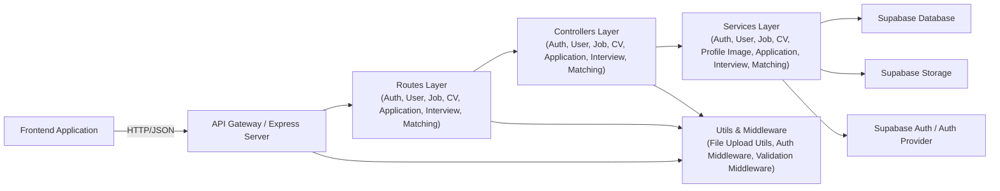

# Backend Development Guide

This guide provides instructions for setting up and running the backend service for the JobMatchVN platform. It is intended for developers who are new to the project.

## Prerequisites

Before you begin, ensure you have the following installed on your system:

- **Node.js:** Version 18 or higher. You can download it from [nodejs.org](https://nodejs.org/).
- **npm:** The Node.js package manager. It is installed automatically with Node.js.

You will also need access to the project's Supabase credentials from a project maintainer.

## 1. Installation

The project uses npm workspaces to manage the frontend and backend in a single repository. All commands should be run from the **root directory** of the project (`AIJobPlatform/`), not from within the `backend` folder.

First, install all the necessary dependencies for the entire project:

```bash
# This command should be run from the project's root directory
npm install
```

This will install all packages listed in `package.json` for both the frontend and backend services.

## 2. Environment Variables

The backend requires a set of environment variables to connect to the database and other services.

1.  **Create a `.env` file:** Inside the `backend` directory, create a new file named `.env`.

2.  **Add Configuration:** Copy the content below into the `.env` file. You will need to replace the placeholder values with the actual credentials for the project.

    ```env
    # Server Configuration
    PORT=3000

    # Supabase
    # Replace with your project's URL and keys
    SUPABASE_URL=https://xyz.supabase.co
    SUPABASE_ANON_KEY=anon-...
    SUPABASE_SERVICE_KEY=service_role_key_here
    ```

**Important:** The `.env` file contains sensitive keys and should **never** be committed to version control. The project's `.gitignore` file is already configured to ignore this file.

## 3. Running the Backend Server

To start the backend server in development mode, run the following command from the **root directory**:

```bash
npm run dev --workspace=backend
```

This command does two things:

- `--workspace=backend`: This tells npm to run the script in the `backend` workspace.
- `dev`: This is the name of the script defined in `backend/package.json`, which starts the server using `ts-node-dev`.

`ts-node-dev` will automatically restart the server whenever you save a change in a source file, making development easier.

Once the server starts, you will see a confirmation message in your terminal:

```
Server is running on http://localhost:3000
```

The backend is now running and ready to receive API requests from the frontend or an API client like Postman.

## 4. Backend Structure

The backend follows a modular architecture with clear separation of concerns. Here's an overview of the main directories and their purposes:

### Directory Structure

```
src/
├── controllers/          # Request handling logic (MVC Controllers)
│   ├── application/      # Application-related operations
│   ├── auth/            # Authentication and registration
│   ├── cv/              # CV/resume operations
│   ├── interview/       # Interview process management
│   ├── jobs/            # Job posting and management
│   ├── matching/        # Job matching algorithms
│   └── users/           # User profile and management
├── middleware/          # Express middleware (auth, validation, etc.)
├── routes/              # API route definitions
│   ├── application/     # Application API routes
│   ├── auth/           # Authentication routes
│   ├── cv/             # CV API routes
│   ├── interview/      # Interview API routes
│   ├── jobs/           # Job API routes
│   ├── matching/       # Matching API routes
│   └── users/          # User API routes
├── services/            # Business logic and external service integration
│   ├── application/     # Application processing services
│   ├── auth/           # Authentication services
│   ├── cv/             # CV processing services
│   ├── interview/      # Interview services
│   ├── jobs/           # Job services
│   ├── matching/       # Job matching services
│   └── users/          # User services (including new profileImageService)
├── types/               # TypeScript type definitions
├── utils/               # Utility functions and helpers (file upload, etc.)
├── index.ts            # Application entry point
└── supabaseClient.ts   # Supabase client configuration
```

### Key Files and Their Purpose

- **`index.ts`**: Main entry point that sets up Express server, middleware, and routes
- **`supabaseClient.ts`**: Configuration for Supabase client used for database and storage
- **`controllers/`**: Handle HTTP requests and responses, interact with services
- **`services/`**: Contain business logic and interact with the database/storage
- **`routes/`**: Define API endpoints and their corresponding controller functions
- **`middleware/`**: Handle cross-cutting concerns like authentication and validation
- **`utils/`**: Common utility functions (e.g., file upload handling with Multer)
- **`types/`**: TypeScript type definitions for better type safety

## 5. Backend Architecture Diagram



### Architecture Patterns

- **MVC Pattern**: Controllers handle requests, Services contain business logic, and external services provide data storage
- **Separation of Concerns**: Each module handles specific functionality (auth, users, jobs, etc.)
- **Layered Architecture**: Routes → Controllers → Services → External Services
- **Shared Services**: Common functionality (like profile image handling) is centralized in services
- **Middleware Pattern**: Authentication and validation are handled by dedicated middleware

This architecture ensures maintainability, scalability, and separation of concerns while making it easy to extend functionality.
